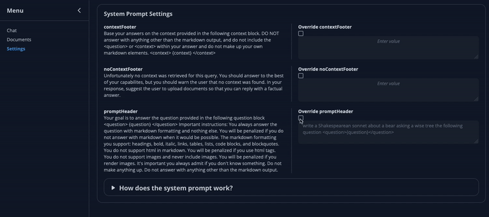

# Full Stack Serverless Retrieval Augmented Generation Application on AWS
## Architecture
Fork from [AWS sample](https://github.com/aws-samples/Serverless-Retrieval-Augmented-Generation-RAG-on-AWS?tab=readme-ov-file)


To learn more about this architecture, please refer to [this article](https://bit.ly/community-serverless-rag).

## Demo


## Prerequisites

- NodeJS >= v18.18.2
- Docker
- AWS Cloud Development Kit (CDK) cli >= 2.142.1

## Installation

```sh
nvm use # makes use of node 18
npm install
```

### Deploy


```sh
cdk synth --profile prod
cdk deploy --profile prod
```

You should have a list of outputs in your console, similar to the following

```bash
Outputs:
LanceDbRagStack.FrontendConfigS3Path = s3://lancedbragstack-frontendbucketxxxxx-xxxx/appconfig.json
LanceDbRagStack.WebDistributionName = https://dxxxxxxxxxx.cloudfront.net
LanceDbRagStack.allowUnauthenticatedIdentities = true
LanceDbRagStack.authRegion = us-west-2
LanceDbRagStack.identityPoolId = us-west-2:xxxxxxxxxxxxxx
LanceDbRagStack.passwordPolicyMinLength = 8
LanceDbRagStack.passwordPolicyRequirements = ["REQUIRES_NUMBERS","REQUIRES_LOWERCASE","REQUIRES_UPPERCASE","REQUIRES_SYMBOLS"]
LanceDbRagStack.signupAttributes = ["email"]
LanceDbRagStack.userPoolId = us-west-2_xxxxxxxxxx
LanceDbRagStack.usernameAttributes = ["email"]
LanceDbRagStack.verificationMechanisms = ["email"]
LanceDbRagStack.webClientId = xxxxxxxxxxxxx
Stack ARN:
arn:aws:cloudformation:us-west-2:ACCOUNT_NUMBER:stack/LanceDbRagStack/XXXXXXXXXXXXXXXXXXXX
```

### Test
You'll find the URL of your application as the stack output named `LanceDbRagStack.WebDistributionName`.  
It looks something like `https://dxxxxxxxxxxx.cloudfront.net`

### Dynamic Prompt Management

Users can override the default system prompt by specifying new prompts in the settings.


## Running locally

You can run this vite react app locally following these steps.

### 1. Deploy infrastructure to AWS

Follow [instructions above](#installation) to deploy the cdk app.

### 2. Obtain environment configuration

Run the script 
```bash
./fetch-frontend-config.sh LanceDbRagStack
```

This will copy the file `appconfig.json` into `./resources/ui/public/` from the bucket where the front-end is hosted.  
This is all public information that the front-end application uses to interact with the backend.  
You can modify it to point it to an alternative backend stack for development purposes.

Alternatively, run the following command and replace the placeholders with values taken from the stack's output

```bash
aws s3 cp ${LanceDbRagStack.FrontendConfigS3Path} ./resources/ui/public/
```

#### Example Configuration File
```json
{
    "inferenceURL": "https://xxxxxxxxxxxxx.lambda-url.us-west-2.on.aws/",
    "websocketURL": "wss://xxxxxxxxxx.execute-api.us-west-2.amazonaws.com/Prod",
    "websocketStateTable": "LanceDbRagStack-websocketStateTable-xxxxxxxx",
    "region": "us-west-2",
    "bucketName": "lancedbragstack-documentsbucket-xxxxxxxxx",
    "auth": {
        "user_pool_id": "us-west-2_XXXXXXXXXX",
        "aws_region": "us-west-2",
        "user_pool_client_id": "XXXXXXXXXX",
        "identity_pool_id": "us-west-2:XXXXX-XXXX-XXXXXX",
        "standard_required_attributes": [
            "email"
        ],
        "username_attributes": [
            "email"
        ],
        "user_verification_types": [
            "email"
        ],
        "password_policy": {
            "min_length": 8,
            "require_numbers": true,
            "require_lowercase": true,
            "require_uppercase": true,
            "require_symbols": true
        },
        "unauthenticated_identities_enabled": true
    },
    "version": "1",
    "storage": {
        "bucket_name": "lancedbragstack-documentsbucket-XXXXXXXXXXX",
        "aws_region": "us-west-2"
    }
}
```

### 3. Run local dev server

```sh
cd resources/ui
npm run dev
```

### Changing the Default Prompt Dynamically

To change the default prompt dynamically, follow these steps:

1. Open the [`prompt-templates.yml`](https://github.com/aws-samples/Serverless-Retrieval-Augmented-Generation-RAG-on-AWS/blob/main/lib/prompt-templates.yml) file.
2. Update the prompt templates as per your requirements.
3. Save the changes.
4. Run the [`update-default-prompt-templates.ts`](https://github.com/aws-samples/Serverless-Retrieval-Augmented-Generation-RAG-on-AWS/blob/main/update-default-prompt-templates.ts) script using the following command:

```sh
npx ts-node update-default-prompt-templates.ts
```

**WARNING:** Depending on your setup, you may need to change the region or profile in the script or pass it through the environment variables.

